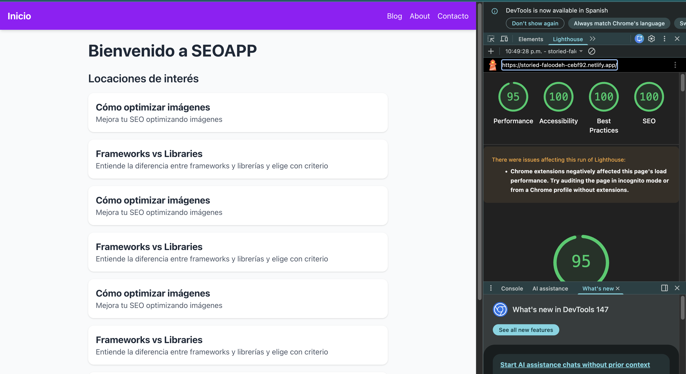
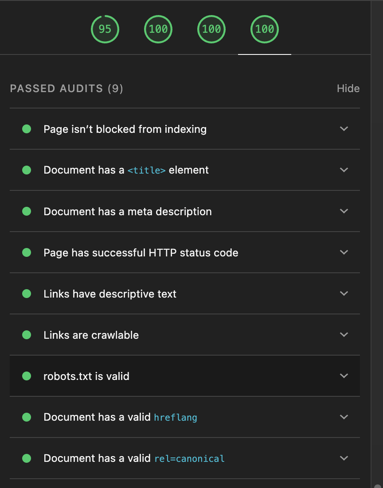
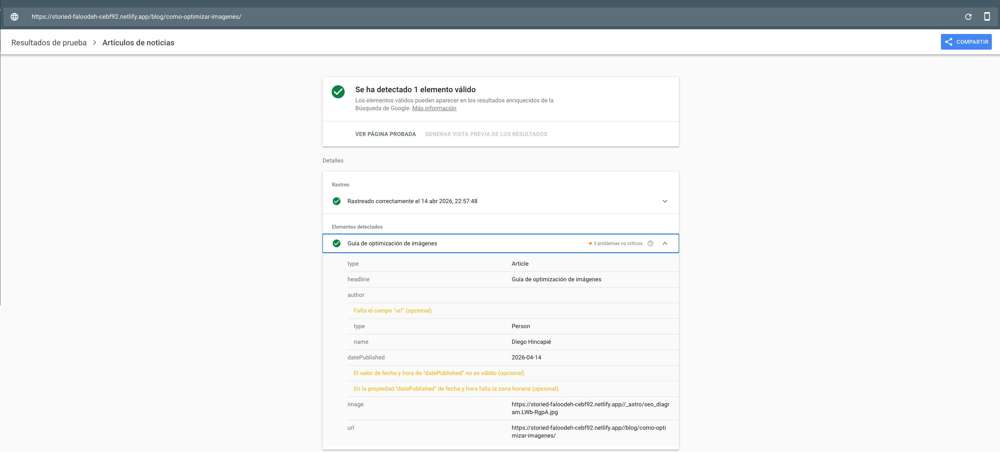
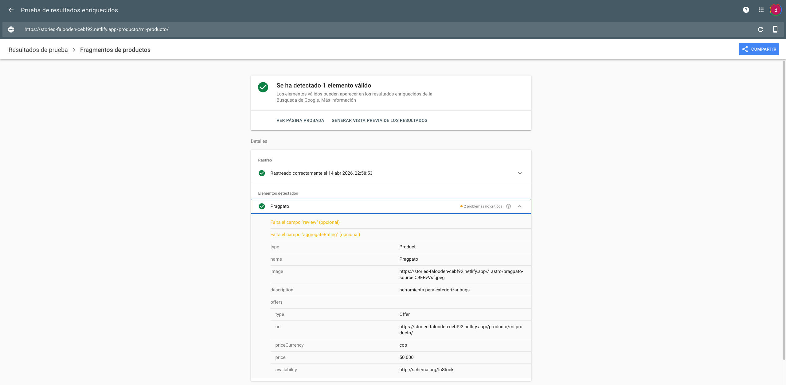

# Práctica SEO

## Descripción del proyecto

Este proyecto se realiza como práctica de SEO con el fin de entender y poner en práctica las diferentes estrategias de mejorar y evaluar el rendimiento que puede llegar a tener una página web en términos de alcance de motores de búsqueda.

## Lista de palabras clave

- SEO
- Schema.org
- Open Graph
- Astro
- lighthouse
- Blog
- Semantic HTML
- Netlify

## Instrucciones de uso

Si lo que deseas es correr este proyecto en local, lo puedes hacer de una manera muy fácil, primeramente debes instalar las dependencias con el comando ```npm i```, una vez tengas las dependencias instaladas, bastará con correr el comando ```npm run dev```, para realizar el despliegue es aún más fácil, el repositorio se encuentra enlazado a netlify y con solo subir cambios a master se realiza el despliegue, si lo que quieres es hacer un despliegue desde cero bastará con usar el comando ```npm build```, tomar todo el directorio generado en ./dist y pegarlo en el hosting de tu preferencia.

## Multimedia de interés

### Lighthouse




### Rich Results


